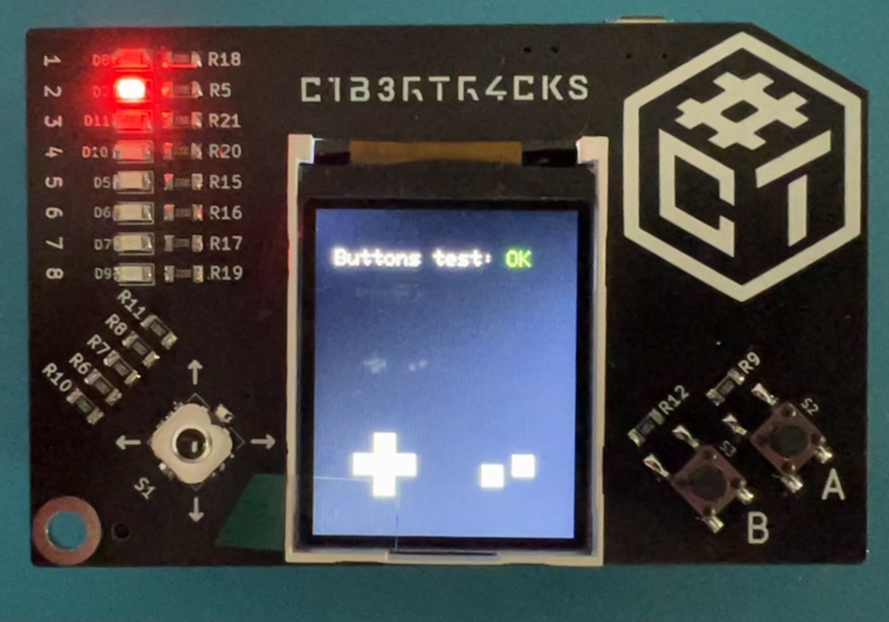

# C1b3rtr4cks Board Tester

### Requirements

#### ESP32 SDK

To install the esp32 sdk, in the Arduino IDE, go to preferences and write the next URL in the `Additional Boards Manager URLs` field:
```
https://raw.githubusercontent.com/espressif/arduino-esp32/gh-pages/package_esp32_index.json
```

Then, go to `Tools->Board->Boards Manager`, write `esp32` in the search field and press install.

Finally, go to `Tools->Board->ESP32 Arduino` and select the board `ESP32 Dev Module` 

#### Libraries

In order to run this sketch, you must have installed the following libraries in your arduino IDE: 

* [ezButton](https://github.com/ArduinoGetStarted/button)
* [Arduino_GFX](https://github.com/moononournation/Arduino_GFX)

To install the libraries, open the Arduino IDE and go to `Program->Add Library->Manage Libraries` and search for each library to install it.


### Tests

When uploaded to the board, the test sketch will light the leds one by one in an endless cycle every 500ms. If all the 8 leds light, the leds are installed correctly

In the screen will be draw 7 squares, representing each of the physical buttons on the board. When each button is pressed, its corresponding square will be filled with white. If all the squares are filled, the the buttons are installed correctly

Finally, after the 2 tests, the sketch will draw graphic tests on the screen in a infinite loop. If the tests are displayed, the screen is installed correctly


